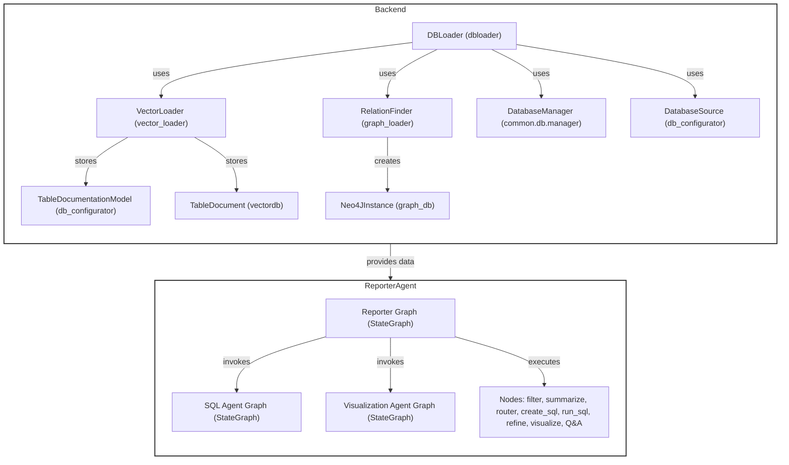
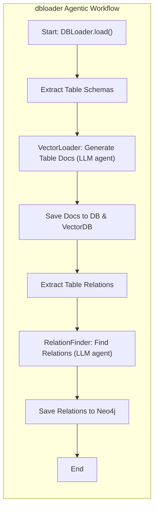
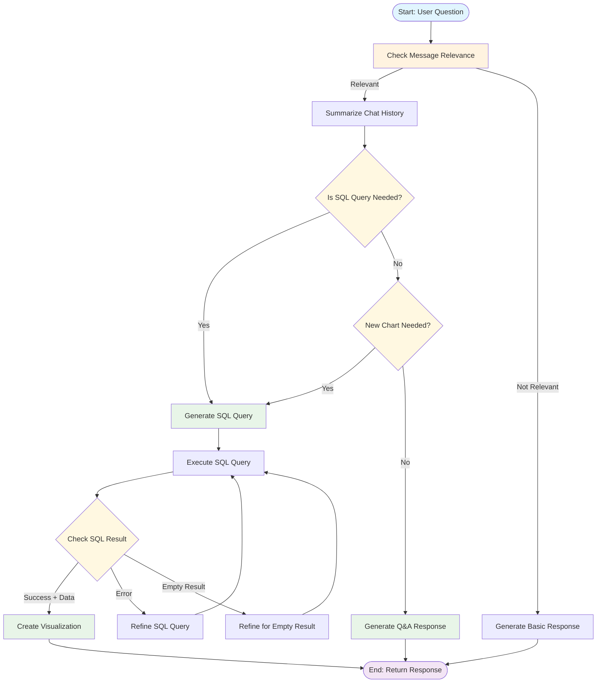
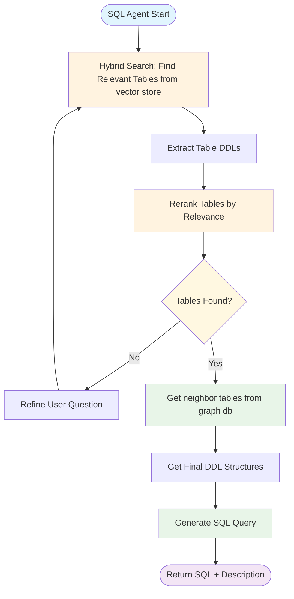
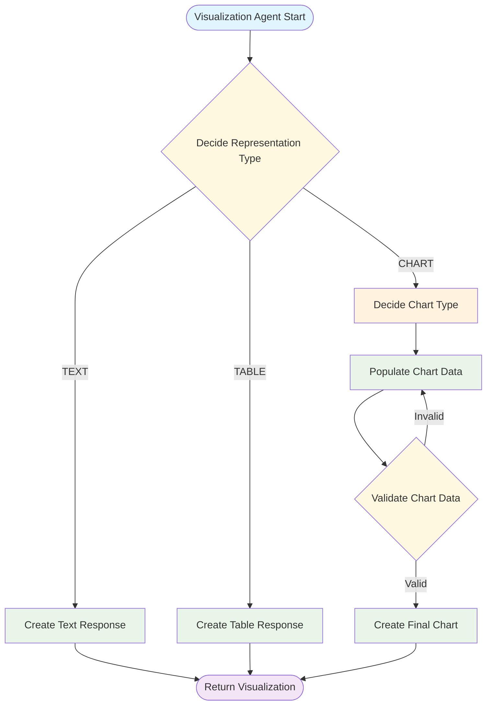

# Datafyme

## Overview

Datafyme is a  agentic reporting system built with Django and modern LLM-based agents. It supports database documentation, relation extraction, and advanced analytical reporting via agentic workflows. The system is fully containerized and integrates with PostgreSQL, Neo4j, and Milvus for advanced data and knowledge management.


### Demo Video (Click the image below)

[](https://drive.google.com/file/d/15dOJHVeKP_wKUV9zrb_SawSX-Eg7ws9e/view?usp=sharing)

**Data Source Support**: Currently supports PostgreSQL as the primary data source. Support for additional database types (MySQL, SQL Server, Oracle, etc.) is planned for future releases.


## Authors

- [Botond Hegedus](https://www.linkedin.com/in/botond-heged%C3%BCs-690982262/)
- [Oliver Suhajda](https://www.linkedin.com/in/suhajda-oliv%C3%A9r-477535295/)
---

## Tech Stack

- **Python 3.12**
- **Django 5.1.1**
- **FastAPI (via Uvicorn)**
- **LangChain, LangGraph** (LLM agent orchestration)
- **PostgreSQL** (main DB)
- **Neo4j** (graph DB for relations)
- **Milvus** (vector DB for semantic search)
- **Docker Compose** (multi-service orchestration)

---

## Dockerized Architecture

The system is fully containerized. Main services:

- `backend`: Django
- `worker`: Background task runner (dbloader, async jobs)
- `django-db`: Main PostgreSQL database
- `mock-db`: Mock/test PostgreSQL database
- `neo4j`: Graph database for entity/relation storage
- `standalone` (Milvus): Vector database for semantic search
- `minio`, `etcd`: Milvus dependencies
- `nginx`: Serves static files and acts as reverse proxy
- `python-code-runner`: Isolated code execution service

---

## High-Level Architecture



---

## dbloader: Purpose & Agentic Workflow

### Purpose

- **dbloader** is responsible for:
  - Extracting table schemas and relations from a database
  - Generating rich documentation for each table using LLM agents
  - Storing documentation in both the main DB and a vector DB (Milvus)
  - Discovering and storing table relations in Neo4j (graph DB)

### Agentic Workflow



- **VectorLoader**: Uses an LLM agent to generate technical and business documentation for each table.
- **RelationFinder**: Uses an LLM agent to infer foreign key/public key relations from DDLs.
- **All results** are stored in the appropriate DBs for later semantic search and graph analysis.

---

## reporter_agent: Purpose & Agentic Workflow

### Purpose

- **reporter_agent** orchestrates the analytical reporting workflow:
  - Receives user questions (in natural language)
  - Determines if a SQL query or simple Q&A is needed
  - Generates, refines, and executes SQL queries using LLM agents
  - Visualizes results (charts, tables, text) using agentic subgraphs

### Agentic Workflow

#### Main Reporter Agent Workflow



#### SQL Agent Subgraph



#### Visualization Agent Subgraph




- **StateGraph**: The workflow is implemented as a state machine (LangGraph), with nodes for filtering, summarizing, routing, SQL generation, execution, refinement, and visualization.
- **SQL Agent Graph**: Specialized subgraph for robust SQL generation and refinement.
- **Visualization Agent Graph**: Specialized subgraph for deciding representation and generating charts/tables.

---

## Deploy Guide

### Prerequisites

- Docker and Docker Compose installed
- Access to the project repository

### Environment Setup

**CRITICAL**: Before starting any services, you must create `.env` files for each service based on the provided `.env.example` templates.

#### 1. Create Environment Files

Navigate to each service directory and create `.env` files:

```bash
# Backend service
cp docker/dev/backend/.env.example docker/dev/backend/.env

# Database service  
cp docker/dev/database/.env.example docker/dev/database/.env

# Neo4j service
cp docker/dev/neo4j/.env.example docker/dev/neo4j/.env

# Vector database service
cp docker/dev/vectordb/.env.example docker/dev/vectordb/.env

# Any other services with .env.example files
# Check each subdirectory in docker/dev/ for additional .env.example files
```

### Deployment Steps

#### Local Development

```bash
# Navigate to development environment
cd docker/dev

# Start all services
docker compose up --build

# Or start in detached mode
docker compose up --build -d
```

### Post-Deployment Setup

#### 1. Create superuser
```bash
docker compose exec backend python manage.py createsuperuser
```

#### 2. Verify Services

Check that all services are running correctly:

```bash
# Check service status
docker compose ps

# Check logs for any errors
docker compose logs backend
docker compose logs django-db
docker compose logs neo4j
docker compose logs standalone  # Milvus
```

#### 3. Access Points

- **Main Application**: `http://localhost:8000` (or your configured port)
- **Django Admin**: `http://localhost:8000/admin`
- **Neo4j Browser**: `http://localhost:7474`

#### 4. First Startup Note

⚠️ **Important**: The first startup will be significantly slower as the system needs to download the BAAI/bge-m3 embedding model (~2GB). This is a one-time download that will be cached for subsequent startups.


